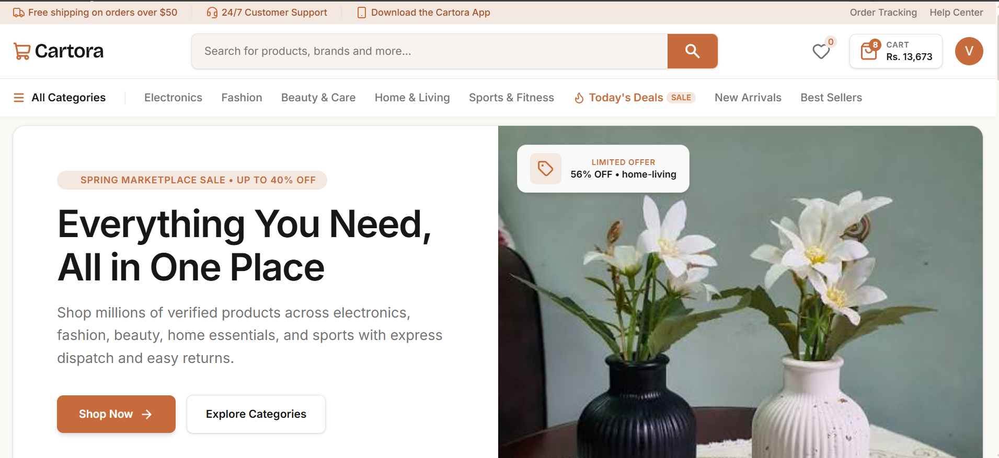
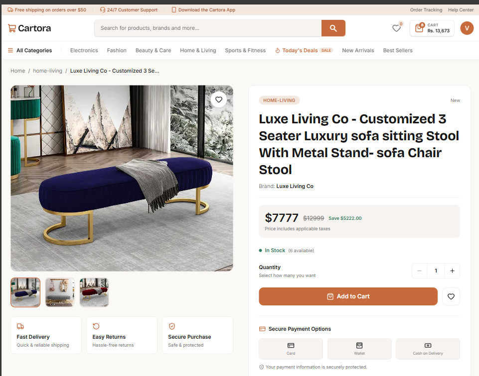
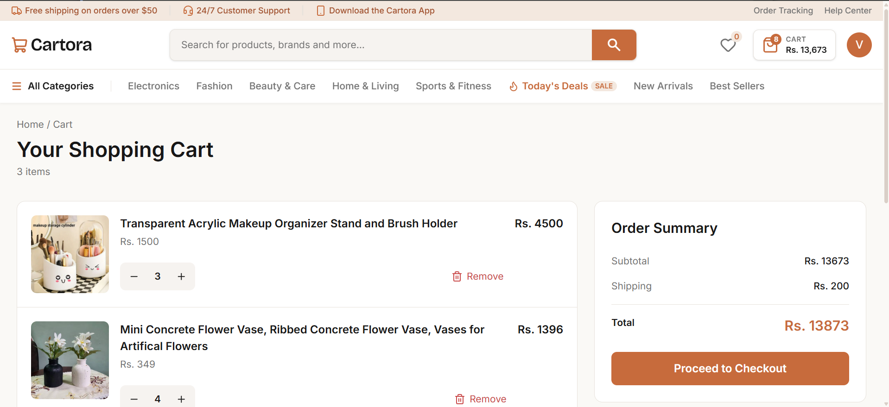
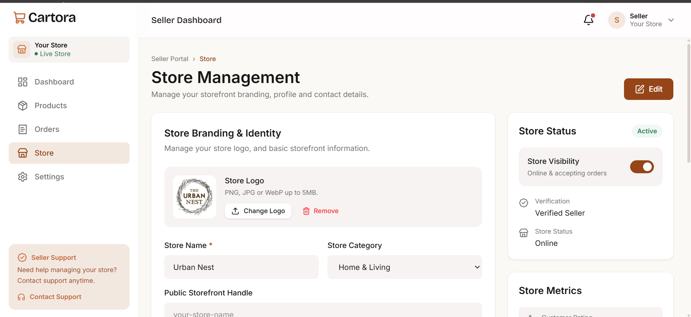
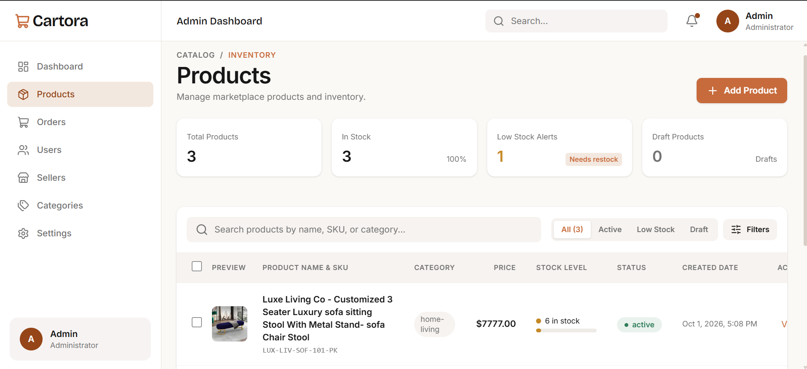

# 🛍️ Cartora

**A full-stack e-commerce marketplace built with the MERN stack.**

Cartora is a modern e-commerce marketplace where **Customers, Sellers, and Admins** have different roles and capabilities. The project focuses on building a complete marketplace experience with role-based authentication, product management, seller management, cart functionality, image uploads, and secure backend authorization.

> 🚧 **Project Status:** In Development  
> Cartora is currently running locally. Checkout, orders, stock management, and deployment are planned for future development.

---

## ✨ Features

### 👤 Authentication & Roles

- Role-based authentication for **Customer, Seller, and Admin**
- Secure login and registration
- Access & refresh token authentication
- Protected routes
- Role-based access control
- Backend authorization

### 🛒 Customer Features

- Browse products
- Search products
- Filter products
- Sort products
- View detailed product information
- Add products to cart
- Update cart quantities
- Remove items from cart
- View cart totals
- Responsive shopping experience

### 🏪 Seller Features

- Seller onboarding
- Seller application and approval flow
- Seller dashboard
- Store management
- Product management
- Add products
- Edit products
- Delete products
- Product image uploads
- Product validation
- Manage product status

### 🛡️ Admin Features

- Admin dashboard
- User management
- Seller management
- View seller applications
- Approve or reject sellers
- Manage seller accounts
- Product management
- Role-based administrative actions

### ⚙️ Backend & Application Features

- RESTful API architecture
- MVC-style backend structure
- MongoDB database
- Mongoose models
- Role & ownership-based authorization
- Request validation
- Error handling
- Image upload handling
- Protected API routes
- Loading, empty, and error states
- Responsive UI

---

## 🧑‍💻 Tech Stack

### Frontend

- **React.js**
- **JavaScript**
- **Vite**
- **Tailwind CSS**
- **React Router**
- **Axios**
- **React Query**
- **Sonner**
- **Lucide React**

### Backend

- **Node.js**
- **Express.js**
- **MongoDB**
- **Mongoose**
- **JWT**
- **Multer**
- **bcrypt**

---

## 🏗️ Project Architecture

Cartora follows a **MERN-based full-stack architecture** with a modular backend organized around an MVC-style structure.

```text
Cartora
│
├── frontend
│   ├── components
│   ├── pages
│   ├── context
│   ├── hooks
│   ├── services
│   └── routes
│
└── backend
    └── src
        ├── controllers
        ├── models
        ├── routes
        ├── middlewares
        ├── utils
        └── db
```

The frontend communicates with the backend through REST APIs, while MongoDB handles application data.

---

## 🔐 Authentication & Authorization

Cartora uses token-based authentication with **access and refresh tokens**.

The application also implements authorization at the backend level, so protected operations are not dependent only on frontend route restrictions.

Examples include:

- Only authenticated users can access protected resources.
- Admin-only operations are protected by role.
- Sellers can manage their own products.
- Users cannot perform actions on resources they do not own.

---

## 📸 Screenshots

### Home / Product Listing



### Product Details



### Shopping Cart



### Seller Dashboard



### Admin Dashboard



---

## 🚀 Getting Started

### 1. Clone the repository

```bash
git clone https